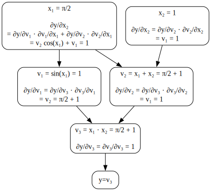

# Automatic Differentiation in Python and VJP

[Yi Wang](https://wangkuiyi.github.io/)

MATLAB and Mathematica implements symbolic differentation.  It is trivial to implement numerical differentiation.  Jingnan Shi's article [*Automatic Differentiation: Forward and Reverse*](https://jingnanshi.com/blog/autodiff.html) compares them with automatic differentiation.

This article focuses on automatic differentation and a concise Python implementation using the idea VJP.  For a short explanation of VJP and JVP, I would recommend my post [*The Jacobian in JVP and VJP*](jacobian.html).

## An Example

This Python implementation is a simplified deep learning toolkit.  Consider an example neural network that computes the following expression, it should be able to compute $\partial y/\partial x_1$ and $\partial y/\partial x_2$ given specific values of $x_1=\pi/2$ and $x_2=1$.

$$
y(x_1, x_2) = \sin(x_1) \cdot (x_1 + x_2)
$$

The following figure illustrates the forward and backward passes:

## The Design

The above figure presents a computation graph.  C++ code may use pointers for the links in the graph.  But for easier memory management, we put nodes in an array and use their indices as the pointers. We can put this array in a class `Tape`.

Except for the node $y=v_3$, which is for annotation, each of the rest nodes in the graph represents an operation, so we need a class `Op`.

There are four different operations in the graph, so we need to derive `Sine`, `Add`, `Mult`, and `Var` from `Op`, where `Var` is for defining input variables.

The class `Op` must have a field `value`.

The class `Op`'s construtor method can take the inputs and calculates the `value` field.

It is easier to initialize an `Op` object by calling a method of `Tape`, so this method can append the `Op` instance to the tape.  As a result, we need methods `Tape.var`, `Tape.sin`, `Tape.add`, and `Tape.mult`.

In this way, the last instance in the tape is the final output, or $v_3$ for the above example.

The backward pass starts from calling a method of the last `Op` instance.  Because the last operation is exactly the final output $y$, so $\frac{\partial y}{\partial v_3}$ is 1.  As explained in [*The Jacobian in JVP and VJP*](jacobian.html), $\frac{\partial y}{\partial v_3}$ is the *v* in VJP.  So we'd like to add the method `Op.vjp` to implement the backward pass.

The operation $v_3$ has two inputs.  So, it's `vjp` method should either pass $\frac{\partial y}{\partial v_3}$ to each one of them, so their `vjp` method computes $\frac{\partial y}{\partial v_3} \frac{\partial v_3}{\partial v_1}$ and $\frac{\partial y}{\partial v_3} \frac{\partial v_3}{\partial v_2}$ respectively, or, the `vjp` method of $v_3$ computes gradients for its inputs and saves the results in each of the inputs.  The latter is easier because the `Mult` operation itself knows how to compute the backward pass for multiplication, or $\frac{\partial v_3}{\partial v_1}$ and $\frac{\partial v_3}{\partial v_2}$ in this example.

After the computation, `Op.vjp` needs to pass the results to all its input operations.  It can do so by calling the `vjp` methods of the input operations.

It is notable that before computing and back propagate the VJP result, the method `vjp` of `op` must wait for and accumulate gradients from all successive operations who use `op`'s value.  For example, the operation $x_1$ is used by $v_1$ and $v_2$.  As a result, it has to wait for and accumulate $\frac{\partial y}{\partial v_1} \frac{\partial v_1}{\partial x_1}$ from $v_1$'s `vjp` and $\frac{\partial y}{\partial v_2} \frac{\partial v_2}{\partial x_1}$ from $v_2$'s `vjp`.

In order to know how many gradients an operation needs to wait for, we need a field `Op.succ`.  To trace how many it has received, we need another field `Op.recv`.

--------------------------------------------------------------------------------

# Automatic Differentiation in Python and VJP

[Yi Wang](https://wangkuiyi.github.io/)

MATLAB and Mathematica implement symbolic differentiation. Numerical differentiation is easy to implement. Jingnan Shi's article [*Automatic Differentiation: Forward and Reverse*](https://jingnanshi.com/blog/autodiff.html) compares these methods with automatic differentiation.

This article focuses on automatic differentiation and presents a concise Python implementation using the idea of VJP. For a brief explanation of VJP and JVP, I recommend my post [*The Jacobian in JVP and VJP*](jacobian.html).

## An Example

Let us develop a very simple deep learning toolkit. Consider a neural network that computes the following expression. It should be able to compute $\partial y/\partial x_1$ and $\partial y/\partial x_2$ for specific values of $x_1=\pi/2$ and $x_2=1$.

$$
y(x_1, x_2) = \sin(x_1) \cdot (x_1 + x_2)
$$

The following figure illustrates the forward and backward passes:

## The Design

The above figure presents a computation graph. In C++, you might use pointers for the links in the graph. However, for easier memory management, we store the nodes in an array and use their indices as pointers. We can encapsulate this array in a class called `Tape`.

Except for the node $y = v_3$, which serves as an annotation, each of the other nodes represents an operation. Thus, we need a class `Op` to represent operations.

There are four different operations in this graph, so we will derive `Sine`, `Add`, `Mult`, and `Var` from `Op`, where `Var` represents the input variables.

The class `Op` must have a field `value`.

The constructor of the `Op` class can take inputs and compute the `value` field.

It is easier to initialize an `Op` object by calling a method of `Tape`, allowing the method to append the `Op` instance to the tape. As a result, we need methods like `Tape.var`, `Tape.sin`, `Tape.add`, and `Tape.mult`.

In this way, the last instance in the tape is the final output, or $v_3$ in the above example.

The backward pass starts by calling a method on the last `Op` instance. Since the last operation is the final output $y$, $\frac{\partial y}{\partial v_3}$ is 1. As explained in [*The Jacobian in JVP and VJP*](jacobian.html), $\frac{\partial y}{\partial v_3}$ is the *v* in VJP. Thus, we add the method `Op.vjp` to handle the backward pass.

The operation $v_3$ has two inputs. Its `vjp` method should either pass $\frac{\partial y}{\partial v_3}$ to each input, allowing their `vjp` methods to compute $\frac{\partial y}{\partial v_3} \frac{\partial v_3}{\partial v_1}$ and $\frac{\partial y}{\partial v_3} \frac{\partial v_3}{\partial v_2}$, or it should compute the gradients for its inputs and store the results directly. The latter approach is easier because the `Mult` operation knows how to compute its backward pass, i.e., $\frac{\partial v_3}{\partial v_1}$ and $\frac{\partial v_3}{\partial v_2}$ in this case.

After computing, `Op.vjp` needs to propagate the results to its input operations by calling their `vjp` methods.

It’s important to note that before computing and propagating the VJP result, `op.vjp` must wait for and accumulate gradients from all subsequent operations that use `op`'s value. For instance, the operation $x_1$ is used by $v_1$ and $v_2$, so it has to accumulate $\frac{\partial y}{\partial v_1} \frac{\partial v_1}{\partial x_1}$ from `v_1.vjp` and $\frac{\partial y}{\partial v_2} \frac{\partial v_2}{\partial x_1}$ from `v_2.vjp`.

To track how many gradients an operation needs to wait for, we add a field `Op.succ`. To track how many it has received, we introduce another field `Op.recv`.
