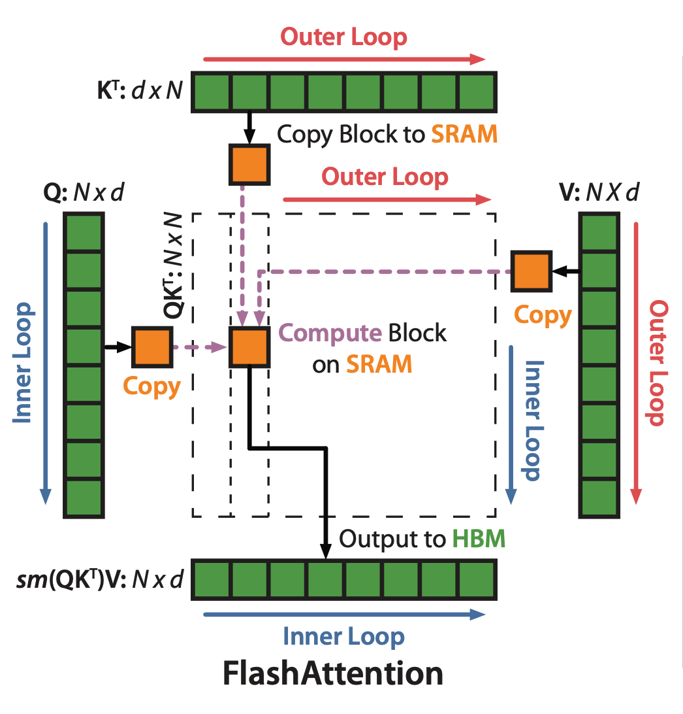

# FlashAttention (Part 3.)

The schematic illustration in the original paper is critical to understand FlashAttention.

Let us denote the index over the outter loop in the above figure as $i$ and that for the inner loop as $k$.  The operation of self-attention is defined as:

$$O = \text{softmax}(Q K^T) V$$

Or, by separating the steps, we denote:

$$
X = Q K^T
A = \text{softmax}(X)
O = A V
$$

For a specific index $k$, the induction processes of self-attention is as the following.  For the simplicity, we ignore $k$. Indeed, each of the following variable, for example, $x_i$, should have been $x_{k,i}$.

$$
\begin{aligned}
x_i &= Q_k K_i^T \\
m_i &= \max(m_{i-1}, x_i) \\
\delta_i &= \delta_{i-1} \exp(m_{i-1}-m_i) + \exp(x_i-m_i) \\
a_i &= \frac{\exp(x_i-m_N)}{\delta_N} \\
o_i &= o_{i-1} + a_i V_i \\
\end{aligned}
$$

The first induction process comes from the fact that each element $a_{k,i}$ is the result of a dot-product between the $k$-th row of $Q$, denoted by $Q_k$, and the $i$-th column of $K^T$, denoted as $K_i^T$.

The second, the third, and the fourth are from [the previous post about Online Softmax](online-softmax.html). 

The last one is the induction process of the dot-product between the $k$-th row of $A$, denoted by $a_{k,i}$, or, short for $a_i$, and the $k$-th column of $V$, denoted as $V_{k,i}$ and short for $V_i$.

Because the fourth induction rule depends on $m_N$ and $\delta_N$, we counldn't start it before the completion of the first three.  However, the fourth and the fifth could run in parallel.

A key contribution of FlashAttention is the derivation of a surrogate $\omega_i$ to replace $a_i$ and $o_i$. This $\omega_i$ can run in parallel with the first three induction rules.

As $\omega_i$ is a surrogate of $a_i$ and $o_i$, let us examing $o_i$ first.

$$
o_i = \sum_{j=1}^i \frac{\exp(x_j - m_N)}{\delta_N} V_j
$$

Using tricks explained in [the post about Online Softmax](online-softmax.html), we want to define $\omega_i$ in the following form so that $\omega_N=o_N$, which is the final result that we want.

$$
\omega_i = \sum_{j=1}^i \frac{\exp(x_j - m_i)}{\delta_i} V_j
$$

Also, we want $\omega_i$ to be inductive, so it should depends on $\omega_{i-1}$:

$$
\omega_{i-1} = \sum_{j=1}^i \frac{\exp(x_j - m_{i-1})}{\delta_{i-1}} V_j
$$

In order to rewrite $\omega_i$ as a function of $\omega_{i-1}$, we need to move 

$$
\begin{aligned}
\omega_i 
&= \sum_{j=1}^i \frac{\exp(x_j - m_i)}{\delta_i} V_j \\
&= \sum_{j=1}^{i-1} \frac{\exp(x_j - m_i)}{\delta_i} V_j + \frac{\exp(x_i - m_i)}{\delta_i} V_i \\
&= \sum_{j=1}^{i-1} \frac{\exp(x_j - m_{i-1} + m_{i-1} - m_i)}{\delta_{i-1}} \frac{\delta_{i-1}}{\delta_i} V_j + \frac{\exp(x_i - m_i)}{\delta_i} V_i \\
&= \sum_{j=1}^{i-1} \frac{\exp(x_j - m_{i-1})}{\delta_{i-1}} \frac{\exp(m_{i-1} - m_i) \delta_{i-1}}{\delta_i} V_j + \frac{\exp(x_i - m_i)}{\delta_i} V_i \\
&= \omega_{i-1} \frac{\exp(m_{i-1} - m_i) \delta_{i-1}}{\delta_i} + \frac{\exp(x_i - m_i)}{\delta_i} V_i \\
\end{aligned}
$$
