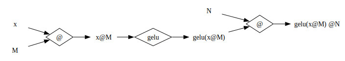

# Roofline Analysis of Operation Fusion with `mlx.core.compile`

Let us consider MLP as an example. 

```python
def mlp(x: mx.array, M: mx.array, N: mx.array) -> mx.array:
    return mlx.nn.gelu(x @ M) @ N
```

The following figure illustrates tensors and operations:



Denote the batch size by $b$, the input dimension by $I, and the intermediate dimension $H$, the total number of flops is the sum of the following:

1. compute `x@M`: $2 b I H$ flops.
1. compute `gelu(x@M)`: $12 b H$ flops, because for each of the $bH$ element, there are 12 flops, according to the definition of GeLU.
1. compute `gelu(x@M)@N`: $2 b I H$ flops.

Consider all variables are in `fp16`. The total number of bytes being loaded and saved include:

1. load `x`: $2 b I$ bytes
1. load `M`: $2 I H$ bytes
1. load `N`: $2 I H$ bytes
1. save and load the activation `x@M`: $4 b H$ bytes
1. save and load the activation `gelu(x@M)`: $4 b H$ bytes
1. save result `genlu(x@M)@N`: $2 b I$ bytes

Therefore, the arithmetic intensity is:

$$ \frac{4bIH + 12 bH}{4bI + 4IH + 8bH} $$

Suppose that `mlx.core.compile` fuses the operations and saves the savings and loadings of the activations. The arithmetic intensity is

$$ \frac{4bIH + 12 bH}{4bI + 4IH} $$


