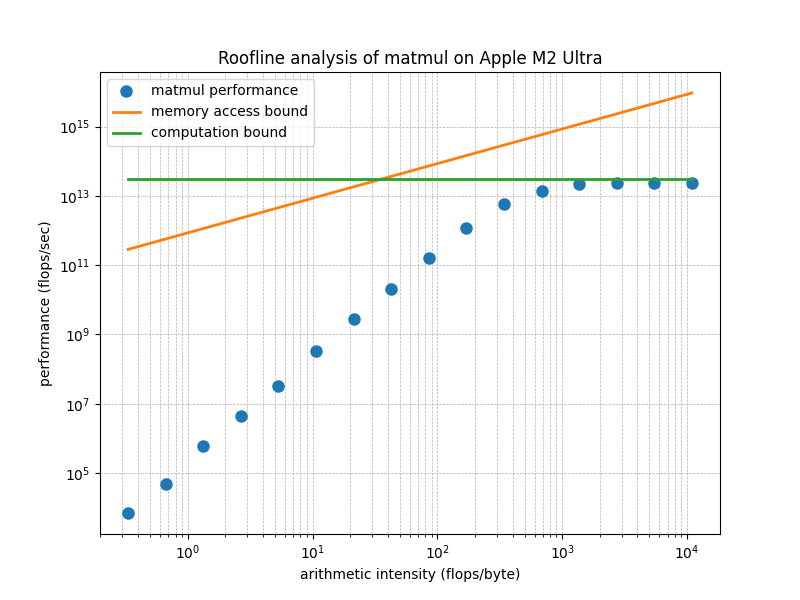
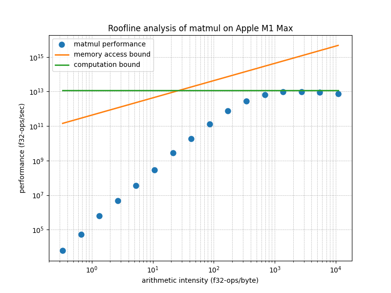

# Roofline Analysis of Apple Silicon GPUs using MLX

Yi Wang <yi.wang.2005 在 Google correo electrónico>

The concept of Roofline analysis was introduced in 2008 in [this paper](https://people.eecs.berkeley.edu/~kubitron/cs252/handouts/papers/RooflineVyNoYellow.pdf), which focused on AMD Opteron CPUs. Later, NVIDIA incorporated Roofline analysis into [Nsight](https://developer.nvidia.com/blog/accelerating-hpc-applications-with-nsight-compute-roofline-analysis/), its CUDA GPU profiling toolkit. The widespread adoption of CUDA GPUs in deep learning has further popularized the use of Roofline analysis. CUDA kernel developers use this method to gauge how close their code is to reaching the hardware’s theoretical performance limits. Numerous blog posts and YouTube videos have since explained Roofline analysis in detail. I've been exploring ways to explain this concept more concisely and illustrate its application on Apple silicon. Here's my attempt.

## The Roofline Model

The Roofline model estimates the upper bound of a chip's performance. A chip has a peak performance, denoted as $\pi$, measured in FLOPS (floating-point operations per second), determined by its computational circuits.

Before an application could start computing, it often needs to load the data. Similarly, it may need to save the result. This impose another limit. If the peak memory access bandwidth is $\beta$ (in bytes per second) and the application performs $I$ flops per loaded or saved byte, the maximum achievable performance is $\beta I$. 

The above two limits make the peak performance a roofline-shaped curve:

$$ \max(\beta I, \pi) $$

The term $\beta I$ depends on $I$, so we plot this relationship on a 2-dimensional graph, where the x-axis represents *arithmetic intensity* $I$ and the y-axis represents performance in FLOPS.

## Arithmetic Intensity

The arithmetic intensity is a property of each application denoting the ratio between its computation and data accessing.  For example, the multiplication of a matrix of size $A\times B$ and another of $B\times C$ involves $A\times C$ dot-products of two vectors with length $B$.  Each dot-product takes $B$ elementwise scalar multiplications and $B$ summations. Therefore, the total flops is $2 A B C$.

If each element of the two matrices is in fp16, the multiplication needs to load $2 A B + 2 B C$ bytes and save the result in $2 A C$ bytes. Therefore, the arithmetic intensity $I$ of matrix multiplications is

$$ \frac{ABC}{AB + BC + AC} $$

In a simplified case where $A=B=C=n$, the arithmetic intensity is $n/3$.

## Roofline Analysis

The following figure presents the analysis of MLX's matmul on M2 Ultra. The two straight lines are the thoretical bound of $\beta I$ and $\pi$, or, the Roofline model of M2 Ultra.  According to the [release note of M2 Ultra](https://www.apple.com/newsroom/2023/06/apple-introduces-m2-ultra/), its peak memory bandwidth, $\beta$, is 800GB/s. According to [this Wikipedia entry](https://en.wikipedia.org/wiki/Apple_silicon#Comparison_of_M_series_processors), the peak performance, $\pi$, is 27.199 teraflops/sec, or TFLOPS.



Each dot corresponds to a matrix-multiplication operation that takes input matrices in a certain size $n=2^i$.  The larger the input matrices, the higher the arithmetic intensity of the operation.

The following figure is for M1 Max, which has less peak performance and bandwidth than M2 Ultra.



From this figure, we see that when the matrix size is large enough, the performance of the matrix multiplication kernel for Apple silicon GPUs provided by MLX achieves about 90% of the theoretical peak performance. This attests to the high code quality of MLX.

## Log-Log Plot

Modern chips can achieve $\pi$ in the teraflops range, which is so large that we typically use a log-scale for the y-axis.

The value of $I$ (arithmetic intensity) can range from below 1 to very large values. For example, an element-wise operation on `fp32` tensors must first load a 4-byte `fp32` value before processing it, and then write the 4-byte result. Its arithmetic intensity is thus $\frac{1}{8}$ FLOPS.  However, the multiplication of two large matrices may have $I$ up to tens of thousands.  This wide range of $I$ suggests that a log-scale is appropriate for the x-axis as well.

Plotting $\pi$ (constant peak performance) on a log-log plot results in a horizontal line, just like its representation on a linear plot. However, plotting the linear function $y = \beta I$ on a log-log plot differs from its linear counterpart.

When plotting a point $(y, I)$ in log-log scale, the coordinates are transformed to $(\log y, \log I)$.  The slope of $y = \beta I$ between two points in the range $[I_1, I_2]$ is given by:

$$
\frac{\log y_2 - \log y_1}{\log I_2 - \log I_1} = \frac{\log (y_2/y_1)}{\log (I_2/I_1)} = 1
$$

Thus, in a log-log plot, all linear functions have a slope of 45 degrees.

The intercept occurs when the x-coordinate $\log I = 0$, or $I = 1$, giving us:

$$ \log (\beta \cdot 1) = \log \beta $$

Therefore, the value of $\beta$, which defines the slope in a linear plot, determines the intercept in a log-log plot. When $\beta < 1$, $\log \beta < 0$. When $\beta > 1$, $\log \beta > 0$.

## Ceilings

The arithmetic intensity of an operation is an intrisic property that represent the operation somewhere on the x-axis. The performance is a property of the implementation of this operation. Various implementations may have various performnace that lies on the line from the x-axis to the roofline.

A suboptimal implementation may not fully utilize the peak memory bandwidth $\beta$, resulting in an effective bandwidth $\beta'$ that is less than $\beta$. Since the bandwidth defines the intercept in the log-log plot, the diagonal line corresponding to $\beta' I$ would have the same 45-degree slope but a lower intercept compared to $\beta I$.

Similarly, a lack of certain optimizations may prevent an application from fully utilizing the chip’s peak performance $\pi$. In this case, the actual performance would be represented by a lower value, $\pi'$, which would appear as a horizontal line below the peak $\pi$ in the roofline plot.

In the original paper about the Roofline analysis, these lower bounds are called ceilings.

## Performance Tuning

In addition to optimizing the implementation, we sometimes change the operation in order to achive better performance.

An example is to use Lower-bits.  Inference in deep neural networks using `fp16` typically does not lead to a significant loss in precision compared to `fp32`. However, using `fp16` halves the number of bytes that need to be loaded and saved, effectively doubling the arithmetic intensity $I$.

Suppose that, prior to this doubling, $I$ lies below the diagonal line on the roofline model, meaning the application is constrained by memory bandwidth—i.e., it is memory-bound. By doubling $I$ to $2I$, may make this new value lies below the horizontal line representing peak performance, the application can potentially shift from being memory-bound to achieving the chip's peak performance.

Another commonly used optimization is **operation fusion**, which reduces the number of loads and saves for intermediate results, often referred to as activations. This optimization also increases the arithmetic intensity $I$, helping the application get closer to the peak performance.

## Benchmarking MatMul

The following program benchmarks the performance of MLX's matmul given two square matrixes of width/height $n$.

```python
import gc
import platform
import subprocess
import time
from typing import List, Tuple

import matplotlib.pyplot as plt
import mlx.core as mx


def get_chip_model():
    # Use 'sysctl' to get information about the Apple Silicon chip
    try:
        output = (
            subprocess.check_output(["sysctl", "-n", "machdep.cpu.brand_string"]).strip().decode()
        )
        return output
    except subprocess.CalledProcessError as e:
        return f"Error retrieving chip model: {e}"


chip = get_chip_model()
bandwidth = {
    "Apple M1 Max": 2**30 * 400,  # https://en.wikipedia.org/wiki/Apple_M1#Memory
    "Apple M2 Ultra": 2**30
    * 800,  # https://www.apple.com/newsroom/2023/06/apple-introduces-m2-ultra
}[chip]
roof = {
    "Apple M1 Max": 2**40 * 10.4,  # https://en.wikipedia.org/wiki/Apple_M1#GPU
    "Apple M2 Ultra": 2**40 * 27.2,  # https://en.wikipedia.org/wiki/Apple_M2#GPU
}[chip]

DT = mx.float16
R = 10

aint: List[float] = []
perf: List[float] = []

for i in range(16):
    N = 2**i

    a = mx.random.uniform(-1.0, 1.0, [N, N], dtype=DT)
    b = mx.random.uniform(-1.0, 1.0, [N, N], dtype=DT)
    mx.eval(a)
    mx.eval(b)
    duration = 0

    for r in range(R):
        start_time = time.perf_counter()
        c = a @ b
        mx.eval(c)
        duration += time.perf_counter() - start_time

    aint.append(N / 3.0)  # 3.0 due to sizeof(fp16)
    perf.append(N**3 / duration * R * 2)

    del a, b, c
    gc.collect()

diag = [bandwidth * ai for ai in aint]
roof = [roof for _ in aint]

plt.figure(figsize=(8, 6))
plt.loglog(aint, perf, "o", markersize=8, label="matmul performance")
plt.loglog(aint, diag, "-", linewidth=2, label="memory access bound")
plt.loglog(aint, roof, "-", linewidth=2, label="computation bound")
plt.xlabel("arithmetic intensity (flops/byte)")
plt.ylabel("performance (flops/sec)")
plt.title(f"Roofline analysis of matmul on {chip}")
plt.legend()
plt.grid(True, which="both", ls="--", linewidth=0.5)

plt.show()
```

The matrix size $n$ goes from $1$ up to $2^15$.  The arithmatic intensity `aint.append(N / 3.0)` comes from the previous derivation.  The performance, $2N^3/d$ FLOPS, where $d$ is the duration of each operation, is from the fact that during the period of execution, the chip runs $n^3$ elementwise multiplications and $n^3$ additions.

## Next Steps

I welcome any feedback on this article. If you find it helpful, I am considering extending this work by benchmarking the MLX implementation of our invention, [Recurrent Drafting](https://www.linkedin.com/posts/yidewang_ml-recurrent-drafterrecurrentdraftingmlx-activity-7247330410358050816-Klg-). Recurrent Drafting is a state-of-the-art speculative decoding method that accelerates the inference of large language models (LLMs).
