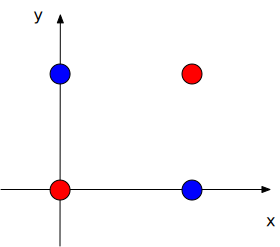
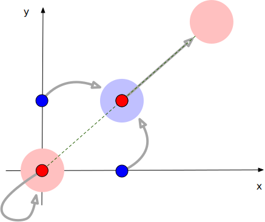

# Train an MLP Using Your Brain Rather Than a GPU to Address the XOR Classification Challenge

This exercise is a great way to understand why activation functions are essential in neural networks.

Imagine being asked about this in a job interview. You're expected to provide an example of a classification problem that:

1. Cannot be solved using a linear classifier,
2. Can be addressed using a multilayer perceptron (MLP),
3. Requires an activation function.

A classic example is the XOR challenge. Surprisingly, when searching for solutions online, several sources [1](https://dev.to/jbahire/demystifying-the-xor-problem-1blk) [2](https://priyansh-kedia.medium.com/solving-the-xor-problem-using-mlp-83e35a22c96f) [3](https://dataqoil.com/2022/06/24/multilayer-percepron-using-xor-function-from/) claim that the backpropagation algorithm can estimate the parameters of an MLP that solves the challenge but fail to provide the estimated parameters. Others [4](https://stackoverflow.com/questions/37734655/neural-network-solving-xor) suggest that an MLP should mimic the logical equation `x1 XOR x2 == NOT (x1 AND x2) AND (x1 OR x2)`, but they do not explain how. A few even present incorrect parameters. This inspired me to attempt solving the XOR challenge manually.

## What Does It Mean to Be Linearly Classifiable?

Consider some points on a 2D plane, each colored either blue or red. The points are linearly classifiable if you can draw a straight line such that all red points lie on one side and all blue points on the other.

For programmers, this definition makes sense because it’s computable. Given the coordinates and colors of points, a linear regression model estimated using error backpropagation can determine where this line should be.

For example, if all red points have a y-coordinate greater than 10, and all blue points have y-values less than 10, the line $y = 10$ perfectly separates them by color.

## The XOR Challenge: Not Linearly Classifiable

In the XOR challenge, there are four points with the following coordinates and colors:

- (0,0) - red
- (0,1) - blue
- (1,0) - blue
- (1,1) - red

Try to imagine a line that separates these points by color—it’s impossible! No matter how you rotate the line, you can’t divide the points by their colors. This is a non-linearly separable problem.

## Transforming the XOR Problem into an Easier Form

While imagining this, you may realize that if we could somehow transform the point (0,1) closer to (1,0), or move (1,1) near (0,0), the points would become linearly classifiable.

One straightforward way to achieve this is through a linear transformation, defined by a matrix $W$ and a bias vector $v$:

$$
W = \begin{bmatrix} w_{11} & w_{12} \\ w_{21} & w_{22} \end{bmatrix}, \quad v = \begin{bmatrix} v_1 \\ v_2 \end{bmatrix}
$$

Applying this transformation to a point $(x, y)$ gives the new coordinates:

$$
(x, y) \rightarrow (w_{11}x + w_{12}y + v_1, w_{21}x + w_{22}y + v_2)
$$

We aim to estimate these parameters without backpropagation, starting with simple guesses.

Let’s begin with both $W$ and $v$ set to zero. This would fuse all points to $(0,0)$, which doesn’t help. If $W$ is diagonally identical and $v$ is zero, no point moves, so the problem remains unsolved.

Now, let’s assume that all entries in $W$ are ones. This gives the transformation:

$$
(x, y) \rightarrow (x + y + v_1, x + y + v_2)
$$

For the XOR challenge, this transformation produces:

$$
(0,0) \rightarrow (v_1, v_2)
$$
$$
(0,1) \rightarrow (1 + v_1, 1 + v_2)
$$
$$
(1,0) \rightarrow (1 + v_1, 1 + v_2)
$$
$$
(1,1) \rightarrow (2 + v_1, 2 + v_2)
$$

Notice that the middle two blue points now coincide. This is progress! However, this setup still doesn’t linearly separate the points, as all of them are now on the same line. This is where activation functions come in to introduce non-linearity.

## Why We Need Activation Functions

Activation functions like logistic, tanh, and ReLU clamp negative inputs to 0 (or a close value). The key idea is to “clamp” points in a way that separates them.

Given the transformed points:

$$
(v_1, v_2), \quad (1 + v_1, 1 + v_2), \quad (2 + v_1, 2 + v_2)
$$

We can choose $v_1$ and $v_2$ such that the activation function clamps one point entirely, partially clamps another, and leaves the third unchanged, thus breaking their alignment on the same line.

Let’s start with $v_1 = v_2$. Unfortunately, this keeps the points on a line parallel to $y = x$. To achieve our goal, $v_1$ and $v_2$ must be negative but different. If the absolute values of $v_1$ and $v_2$ are less than 2, the third point remains unclamped, while the first point gets clamped to $(0,0)$. We aim for one coordinate of the second point to be clamped while the other remains positive, which leads to:

$$
v_1 = -0.5, \quad v_2 = -1.5
$$

## Now, We Can Linearly Classify!

After the linear transformation and activation, the four points transform as follows:

$$
(0,0) \rightarrow \sigma(v_1, v_2) = (0,0)
$$
$$
(0,1) \rightarrow \sigma(1 + v_1, 1 + v_2) = (0.5, 0)
$$
$$
(1,0) \rightarrow \sigma(1 + v_1, 1 + v_2) = (0.5, 0)
$$
$$
(1,1) \rightarrow \sigma(2 + v_1, 2 + v_2) = (1.5, 0.5)
$$

Denote a coordinate from the above transformation by $(h_1, h_2)$, we can easily draw a line separating the red points from the blue points:

$$
h_2 = \frac{0.5}{1.5} h_1 - 0.001 = \frac{1}{3} h_1 - 0.001
$$

The slope is derived from the third point, as the first two are on the x-axis. The intercept $-0.001$ is a small negative value to ensure proper separation.

According to the rule of calcualting the distance from a point to a line, we have the indicator

$$ s = 3 h_2 - h_1 + 0.003 $$

To make the indictor more distinguishable, i.e., make positive values closer to 1 and negative values closer to 0, we can apply the activation function again:

$$ s = \sigma(3 h_2 - h_1 + 0.003) $$

## The MLP for Solving XOR

An MLP is defined by the following equations. Given a point $(x, y)$, the MLP computes:

$$
s = \sigma(v_1 h_1 + v_2 h_2 + c)
$$
$$
h_1 = \sigma(w_{11}x + w_{12}y + b_1)
$$
$$
h_2 = \sigma(w_{21}x + w_{22}y + b_2)
$$

From the above derivation, we can estimate the parameters needed to solve the XOR classification:

$$
s = \sigma(- h_1 + 3 h_2 + 0.003)
$$
$$
h_1 = \sigma(x + y - 0.5)
$$
$$
h_2 = \sigma(x + y - 1.5)
$$

If $s > 0$, classify $(x, y)$ as red; otherwise, classify it as blue.

## Conclusion

Here is the MLP we derived to solve the XOR problem as a mental exercise, relying purely on human reasoning. I hope this gives you an intuitive understanding of the key characteristics of activation functions: (1) clamping negative values, and (2) acting as an indicator for classification. These functions are crucial components of an MLP.

There are many more activation functions beyond logistic, tanh, and ReLU. [This post](https://dublog.net/blog/all-the-activations/) provides a comprehensive overview of them.
